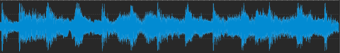

# 2425_5AHEL_MWIT_Diashow
Eine Diashow wird aus mehreren Bildern zusammengestellt werden. 

## TkInter
Gestaltung der Oberfläche für Diashow-Generator. Wichtige Inhalte:
* TimeLine
  * Zeitleiste - zeigt eine horizontale Linie mit Unterteilung in Sekunden 
  * Spur(en) mit Bildern welche zu einem bestimmten Zeitpunkt - für eine gewisse Zeit angezeigt werden
  * Spur(en) für Sounddateien, welche ab einem bestimmtzen Zeitpunkt für eine gewisse Zeit abgespielt werden

## Bild/Video

### Thumbnails
Erzeugung von Thumnails zu einer Liste von Bildern. Die Größe der Thumbnails muss über einen Parameter einstellbar sein.

### Video aus Bildern 
Aus mehreren Bildern wird ein Video erstellt, wobei jedes Bild für eine bestimmte Zeit dargestellt wird.
[Melikoglu]
- TODO: Mit Klassen arbeiten

### Übergänge
Wichtige Prameter für alle Übergänge:
* Name des Originalbildes
* Zeit wie lange der Übergang dauern soll (in Sekunden)
* Anzahl der Bilder pro Sekunde
Bei jedem Übergang muss eine Serie von Bildern erzeugt und gespeichert werden!
#### Schwarzblende - Fade to Black [Dürnberger]
Das Originalbild wird Schritt für Schritt immer dunkler - bis dieses am Ende des Überganges ganz schwar ist!
#### Von der Seite - Wischen [Gramer]
Das neue Bild schiebt sich von der Seite über das alte Bild.
#### Auflösen - Pixelate [Buchegger]
Das alte Bild wird in Pixel/Blöcken aufgelöst, d.h. die Pixel/Blöcke werden transparent gesetzt. Dadurch wird das
darunter liegende Bild sichtbar.
#### Schieben
Das neue Bild schiebt das alte Bild nach oben, unten, links oder rechts aus dem Bild.
#### Zoom: 
Das alte Bild wird herausgezoomt, während das neue Bild hereingezoomt wird.
#### Drehen: 
Das alte Bild dreht sich heraus, während das neue Bild sich herein dreht.
#### Kreisblende: 
Ein Kreis, der sich von der Mitte des Bildes aus ausdehnt oder zusammenzieht, um das nächste Bild zu enthüllen.
#### Diagonalblende: 
Das Bild wird diagonal überblendet, wobei das neue Bild von einer Ecke zur anderen eingeblendet wird.

## Audio

### Fadeing [Karahasanovic]
Wichtige Parameter für das Fading:
* Name der Sound-Datei(en)
* Dauer des Überganges (in Sekunden)
#### Fade-In
Die Lautstärke wird von 0% bis 100% erhöht.
#### Fade-Out
Die Lautstärke wird von 100% bis 0% verringert.
#### Crossfade
Bei der ersten Datei wird die Lautstärke von 100% auf 0% verringert, während gleichzeitig bei der zweiten Datei die Lautstärke von 0% bis 100% erhöht wird.
### Cut [Mladenovic]
Eine Sound-Datei muss am Anfang bzw. am Ende gekürzt werden - wichitge Parameter:
* Name der Sound-Datei
* Länge der resultierenden Datei (in Sekunden)
* Cut-Richtung (CUT-LEFT: Datei wird am Anfang beschnitten, CUT-RIGHT: Datei wird am Ende beschnitten)
### Wellenformdarstellung ...
Darstellung der Wellenform einer Sounddatei - wichtig für die Bearbeitung von Sounddateien.

### FFT
### Überlappen von Audios
### Text <-> Speech [Prüller]
Offline Funktionalität möglich???

## Terminplan

* 11.2.
* 18.2. Semesterferien
* 25.2.
* 4.3.
* 11.3.
* 18.3.
* 25.3.
* 1.4.
* 8.4.
